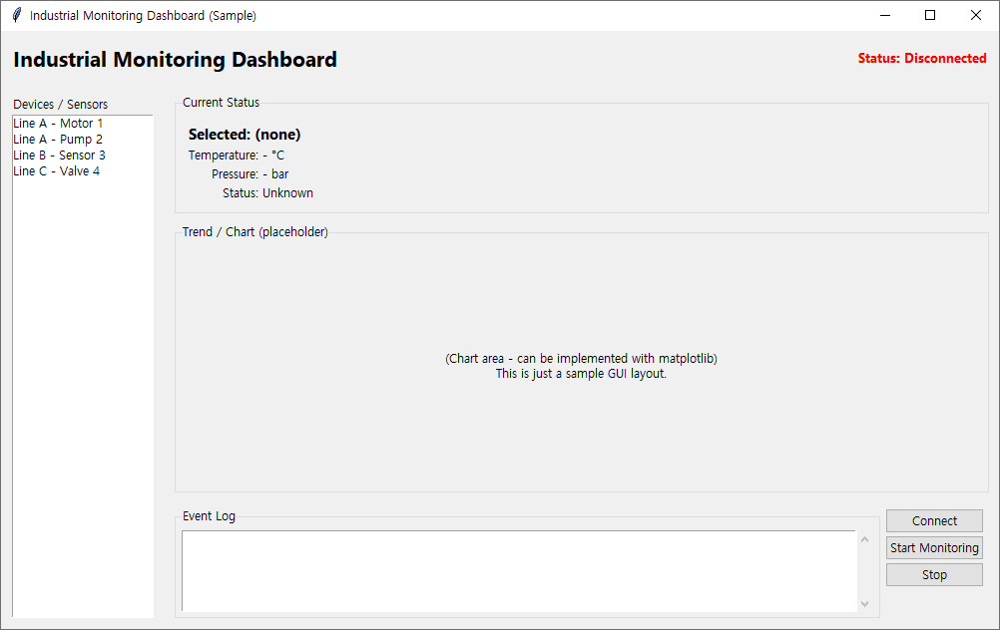
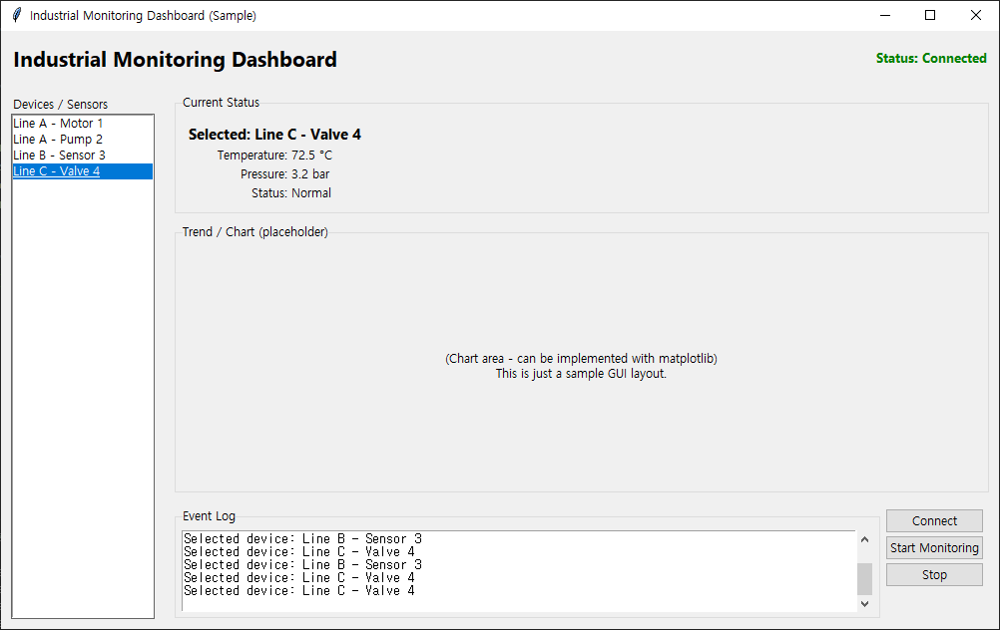

# Python Tkinter Industrial Monitoring Dashboard (Sample)

This repository contains a **sample industrial monitoring dashboard**
built with **Python and Tkinter**.

The goal of this project is to demonstrate a clean, extensible desktop GUI layout
that can be used for:

- industrial device monitoring
- sensor data visualization
- real‑time status updates
- event logging
- Windows‑based automation/control tools

It is also intended as a **portfolio piece** for platforms like **Upwork** and **Fiverr**.

---

## 🔧 Features

Current demo features:

- **Device / Sensor list** on the left
- **Current status panel** on the top right  
  - Selected device name  
  - Temperature (sample value)  
  - Pressure (sample value)  
  - Status label
- **Chart / Trend placeholder** in the middle  
  - Ready for integration with `matplotlib` or other plotting libraries
- **Event log** at the bottom  
  - Auto‑scrolling text area
- **Control buttons**  
  - `Connect`  
  - `Start Monitoring`  
  - `Stop`
- **Logging** using Python’s built‑in `logging` module  
  - Events are written both to the on‑screen log and to the logger

---

## 🏗 Project Structure

```text
python-tkinter-industrial-monitoring-dashboard/
├─ monitoring_app/
│  ├─ __init__.py          # Package export for MonitoringApp
│  ├─ app.py               # MonitoringApp class (main Tkinter GUI)
│
├─ screenshots/
│  ├─ dashboard_main.png   # Main layout screenshot
│  ├─ dashboard_log.png    # Example with selected device + log entries
│
├─ main.py                 # Entry point script
├─ README.md               # This file
├─ requirements.txt        # Optional dependencies (e.g. matplotlib)
└─ .gitignore
```

---

## ▶️ How to Run

1. Clone the repository
```bash
git clone https://github.com/nyongdev0310/tkinter-monitoring-dashboard-sample.git
cd tkinter-monitoring-dashboard-sample
```

2. (Optional) Create virtual environment
```bash
python -m venv .venv
source .venv/bin/activate  # Windows: .venv\Scripts\activate
```

3. Install optional dependencies
```bash
pip install -r requirements.txt
```
For this basic demo, Tkinter and logging are part of the Python standard library.
matplotlib is only needed if you want to implement real charts.

4. Run the app
```bash
python main.py
```
You should see a window like this:
Screenshots (example)
  


---

## 🧠 Design Overview

The GUI is implemented as a single MonitoringApp class that inherits from tk.Tk.

Key layout areas:

1. Header bar
- Application title
- Connection status label (Disconnected / Connected)

2. Left panel – Device list
- Listbox with sample devices:
  - Line A - Motor 1
  - Line A - Pump 2
  - Line B - Sensor 3
  - Line C - Valve 4
- When a device is selected, the status panel and log are updated.

1. Right panel – Status, chart, log, controls
- Current Status frame
  - Selected device name
  - Sample temperature / pressure / status labels
- Chart frame (placeholder)
  - Simple label indicating where charts/trends will be rendered
- Bottom frame
  - Event log (tk.Text with scrollbar)
  - Control buttons (Connect / Start / Stop)

The code is intentionally kept simple and readable, but structured in a way that
it can be extended into a real industrial monitoring application:
- plugging in real sensor data
- reading from APIs or databases
- adding alarm thresholds & colors
- drawing real‑time charts
- persisting logs

---

## 🧪 Code Style & Architecture

- Python standard library only for the core demo (Tkinter + logging)
- Class‑based GUI (MonitoringApp)
- UI creation split into small private methods:
  - _create_header
  - _create_main_area
  - _create_left_panel
  - _create_right_panel
  - _create_status_frame
  - _create_chart_frame
  - _create_bottom_frame
- Type hints for methods
- Docstrings for main methods and the class
- Logging for key events (device selection, connect/start/stop)

This makes it easier to:
- maintain and extend the code
- discuss architecture with clients
- plug into a larger application or service

---

## 🎥 Demo Video

You can see the dashboard in action here:

[▶ Watch on YouTube](https://youtu.be/X_GSoWZTg4Q)

Or click the thumbnail below:

[](https://youtu.be/X_GSoWZTg4Q)

---

## 🚀 Possible Extensions

Some ideas for future improvements:
- Integrate real sensor data or API endpoints
- Add configurable alarm thresholds and color‑coded statuses
- Embed matplotlib charts inside the chart frame
- Store logs in a database or file
- Add settings dialog (e.g., connection options, device configuration)

---

## 💼 Portfolio / Freelance Context

This project is designed as a portfolio piece for:
- Upwork
- Fiverr
- other freelance or job platforms

It demonstrates:
- Python desktop GUI skills (Tkinter)
- basic application structure and layout design
- ability to build monitoring/automation tools
- awareness of logging, status handling, and user feedback

---

## 📩 Contact

GitHub: [@nyongdev0310](https://github.com/nyongdev0310)
Upwork: [@nyongdev0310](https://www.upwork.com/freelancers/~01aa3c1c2c15726154)
Fiverr: <Your Fiverr profile URL>

- Feel free to reach out if you need:
- custom desktop automation tools
- monitoring dashboards
- web scraping + GUI integration
- Python/Tkinter or C# desktop applications
